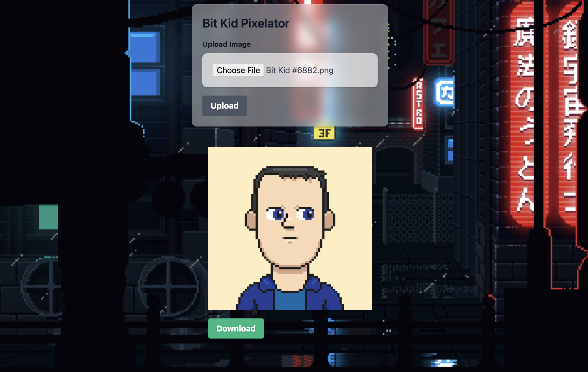

# Bit Pixels Uploader and Resizer

Simple tool to remove the  CRT effect from [BitKids](https://www.stargaze.zone/m/stars1pqcldy82fcmptkzvzakwlv3gtpgupewc3e3q598mg5nrr25rv40qpu0z5v) and see [@pixlgeist](https://twitter.com/bitkidsart) original art.



## Prerequisites

Before running this project, make sure you have the following installed:
- Node.js (10.x or above)
- npm (6.x or above)

## Getting Started

These instructions will get you a copy of the project up and running on your local machine for development and testing purposes.

### Installation

Clone the repository to your local machine:

```
git clone https://github.com//daniel-farina/bitkids-pixels.git
cd bitkids-pixels
```

### Install the necessary npm packages:

```
npm install
```

### Running the Application
To start the application, run the following command in the terminal:

```
npm start
```
This will start the server on localhost with the default port 3001. You can access the application by navigating to http://localhost:3001 in your web browser.

### Uploading an Image
To upload an image, click on the "Upload Image" button and select an image from your file system. The image will be automatically uploaded to the server, resized, and displayed in a pixelated format on the web page.

### Downloading the Resized Image
Once the image is processed and displayed on the webpage, you can download it by clicking the "Download" button that appears below the image.

### Built With
Express - The web framework used
Multer - Middleware for handling multipart/form-data
Sharp - High performance Node.js image processing

### Contributing
Please read CONTRIBUTING.md for details on our code of conduct, and the process for submitting pull requests to us.

### License
This project is licensed under the MIT License.

### Acknowledgments
https://twitter.com/osmolad for sharing the idea on [Twitter](https://twitter.com/osmolad/status/1720863854047932697)
https://twitter.com/bitkidsart for his amazing work
[website Background](https://steamcommunity.com/sharedfiles/filedetails/?id=1279685339)